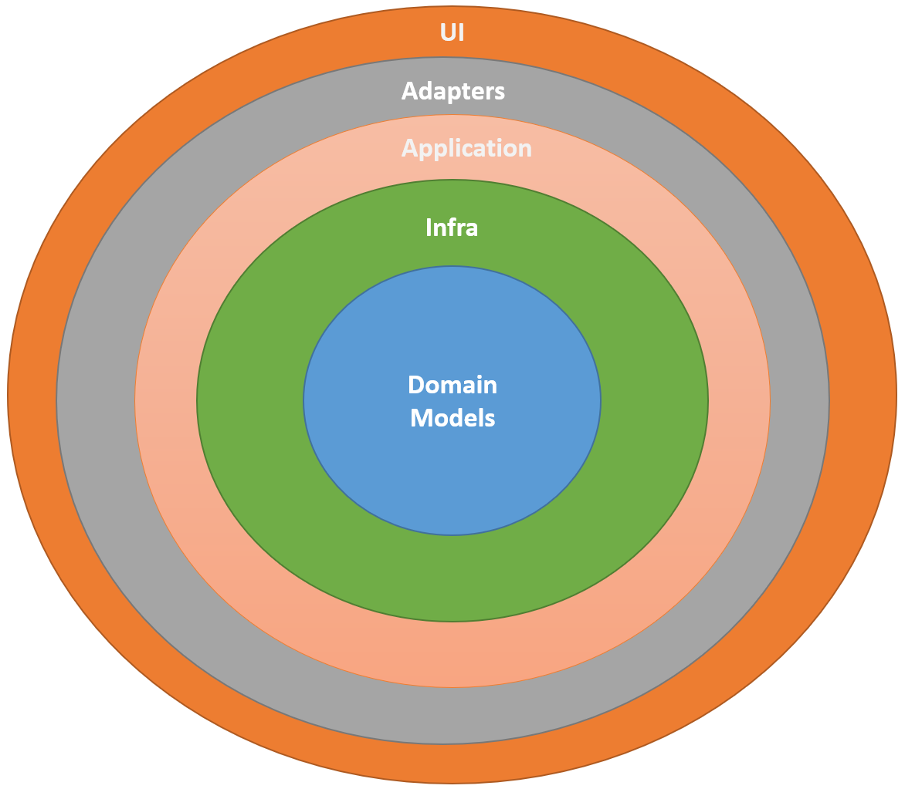
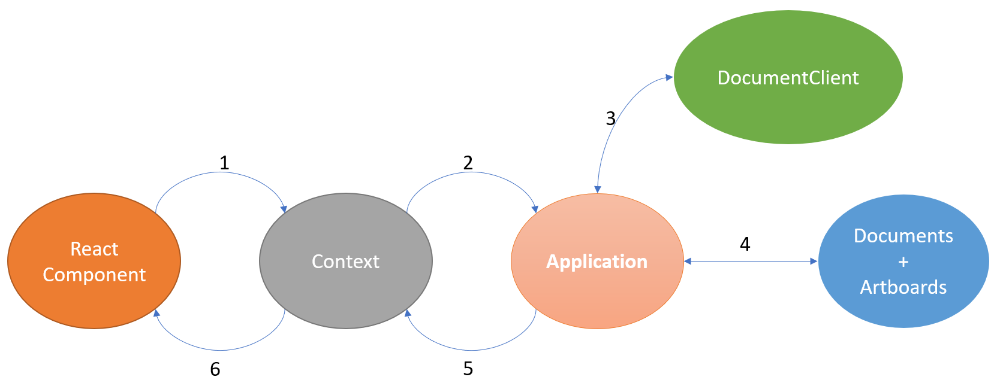
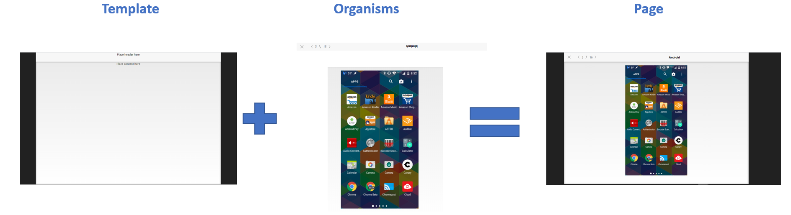

# Sketch Document Viewer

### by [Eneko Bikandi](https://www.linkedin.com/in/ebikandi/)

This project has been developed for the Sketch frontender application process. It had to be a copy of the a document viewer presented en the exercise (all the detail are in the _EXERCISE.MD_). This have given me the opportunity to develop something differrent apart from the usual React + Redux app, with a layered architecture that I'll explain further. Moreover, I must say that I have walked the **extra mile** requested in the test.

- Documents are requested based on the url param. A link has been introduced in the title header to switch between documents. Also, each document will only be request once on each load and will be cached. So, we can be switching 1000 times without worrying to do a lot of requests.
- Some testing have been introduced. There is not much, but it works as an example.

I would like to say that the **original window resizing and size responsiveness** from the prototype has been respected and the layout always mantains an aspect ratio close to 4:3. I would preffer using a responsive column with liquid margins to wrapp the contenct, specially for the ArtboardGrid. But as the prototype was like this, I prefered to maintain it as it is.

Also, a decision has been taken out of the given example. In the given prototype, the document has only 10 artboards which fit in the content grid, but the real one fetched from the api has much more. And these do not fit in the grid. So, in this case, it has been decided to show a vertical **scrollbar**.

In this document here I will defend my solution. First, I will explain why I took this approach and the problems I have encountered. After that, I want to list some future work and ideas I have in mind and I would take if I had the time. Finally, we'll go quickly through the steps to run the app.

## Taken approach

The requisites of the task were pretty clear form the beginning thanks to the description in the EXERCISE.md. So, first of all, tools had to be chosen:

- **React**. This is pretty straightforward, as it's use was a requisite from the exercise.
- **Hooks and Context**. As I said, I wanted to go far from Redux from now. It is a tool that I use in my everyday job and, besides I think it's a useful tool (specially with the Sagas), sometimes it adds a lot of boilerplate and verbosity to the codebase. So I wanted to go for a different apporach and I have chosen these two for state management.
- **ApolloClient**. As the data had to be fetched from a GraphQl, this client gives this feature pretty easily.
- **Typescript**. Good tool to use instead of the usual React.PropTypes. Also, will give us type checking and autocomplete.
- **Styled-Components**. My aim was to implement components follwing Bard Frost's Atomic Design proposal, so this tool would help me insulating the styles on each component. Also, as it accepts Sass lexic, used with BEM nomenclature would improve each style's readility.
- **React-Router**. As this App logic goes mainly on navigation between different document and artboard pages, React-Router gives the abbility to handle this routes easily.
- **React-Testing-Library**(+ Jest). A lighter alternative to Enzyme, it is added by default in Create-React-App and it's pretty handy to test components.

This said, lets go to the complex point of the solution.

### Architecture

As I have been dealing with some big monoliths with coupled components, I wanted to implement a concept I had in mind for time. I implemented the solution using a layered architeqture inspired in the Hexagonal Architecture, where the logic would be divided in layers and a layer would only have dependencies with it's inner adjacent layer.



- **DomainModels**. The folder where the main domain entities are present. In this case Document and Artboard. Each Document will have _N_ Artboards.
- **Application**. The main applications use cases. **Infra** would go here also.This app main use case is about fetching the Documents, so it has a client which implements _IDocumentRepository_. This acts like a contract so the _appService_ only has to know this method names without worrying about the implementations. This time we use a GraphQlClient, but if in the future we would like to fetch the data from another place (e-g a Mongo, PostgreSQL, ...), we only have to implement a client implementing _IDocumentRepository_ and _appService_ would still run fine. As this app is simple. it only cares about fetching data but if we would want CRUD operations, for example, we would set them here.
- **Adapters**. The layer which communicates with the _appService_ and then serves the data to the UI. State management tools go here. This time we're using Contexts but if we would like to introduce Redux, we would only need to set it in this layer only worrying for handling the needed actions and the rest would be running as usual.
- **UI**. As the name says, the main UI parts go here. This time all the React components are here. But think if we would like to replace it with Vue, for example.

So, as an example, the getDocumentById flwo would go like this:


1. React tells the context that it wants to fetch X document. Can be dispatching an action, useing an effect,...
2. The Context calls the needed _appService_'s use case to start the fetch.
3. The _appService_ uses the DocumentClient (this time a GraphQL client) to get the data from the server.
4. After getting the data, the _appService_ maps it to our apps domain entities.
5. Return the mapped data to the context.
6. The Context communicates React that it has the the data. Can be by setting the new data in the State, for example.

And that's it. Each layer is decoupled and ready to be extended/replaced.

### UI

Apart from the overall logic, the UI part of the app has been organized also following a methodology to make it hte most extensible and composable possible, the [Atomic Design](https://bradfrost.com/blog/post/atomic-web-design/).

There's much literature about this topic open to each one's interpretation, so we'll not going to spend much time explaining this. The main idea is that components and divided in the smaller parts possible, called _atoms_. These compose some more complex components, _molecules_. And composing these, we get the _organisms_. Then, you define a template which will serve as an skeleton to set the organisms in the layout. Finally, you build pages combining the needed organisms and setting them in the template.



This aims to increase reusability between components. Also, the pages wrapp all the logic, so the atoms, molecules and organisms are dumb in that way, and they only care about style. One example is in the _ArtboardView.tsx_ file, where the component sets the routes that will be handled from the NavigationBar.

```javascipt
  const NavigationBarProps = {
    closeRoute: `/document/${doc?.shortId}`,
    goPrevRoute: `/artboard/${prevId}`,
    goNextRoute: `/artboard/${nextId}`,
    text: currentArtboard?.name || '',
    current: currentId + 1,
    total: numArtboards,
  };

  const header = <NavigationBar {...NavigationBarProps} />;
```

Anyway, all is not good here because this approach drives to **PropDrilling** between components, which is not a good practice. This, with the rest of the problmes, will be explained in the next point.

## Problems and future work

As I said, it has not been a road of roses all the way and I have encountered some issues during the dev fase. I have to admit that developing this whole architecture has been motivating but it has taken me longer that I thought at the beginning, so I have less time to invest on some aspects. Hence, I had to prioritize some over others.

- **Responsiveness**. Main thing here, being this a test for a Frontender position. Overall, the app is responsive but I am not quite happy about it because I see some issues:

  - Resizing can cause some elements missalignment in the headers.
  - ArtboardGrid cells size varies depending on the items shown.

- **BrowserCompatibility**. Despite having some styling problems in Firefox, the app is fully running in Chrome and Firefox, but it does not start in MS Edge. This should be investigated.
- **Tests**. the coverage is quite poor. I've run out of time and I only have time to develop some test as example.
- **PropDrilling**. As said before, the way pages are built drives us to a PropDrilling problem. This app is small so it's not big deal, but in bigger apps it could be an issue.
- **Lots of divs**. As almost each atom, molecule,... has it's container, the resulting HTML code has a lot of nested divs that can be simplified, maybe using _React.Fragments_.
- **Atomic Design Hierarchy**. Overall, the structure is good but there is an organims importing an atom. That takes me to think the structure can be improved.
- **Cleaning**. The project has been creaed with Create-React-App. This is an awesome tool that creates you a React project ready to start developing, but it introduces a lot boilerplate. So surely there will be packages and code that are not used. These should be cleaned.
- **TODOs**. There are some TODOs left over the code where I see that something can be improved or refactored. Review them.
- **Static Site**. This site would be perfect to be server side rendered and Gatsby would be the right tool for this.

## Setting up the code

It's quite easy to run this code thanks to yarn/npm and React's scripts. So lets list some steps to run this app in your laptop.

1. Clone the repo in your machine.
2. Go to the repo's folder via a terminal window and type `npm install` or `yarn install`.
3. Run `npm start` or `yarn start`

And that's it, the 3rd step will start a dev-server in your machine and open a browser window with the app there. Additionally, it will point you which on the command promp the urls the app is running. I would **play resizing the window and navigating through arboards to test the behaviour**.

Another thing you can you is run the tests with `npm test` or `yarn test`. This should run the tests (which are inside the \_\_tests\_\_ folder). Currently there is only the _DocumentView.test.tsx_ implemented.

## Thanks

That's all for me. Independently of your decision, I want to thank you for this opportunity. I'll wait eagerly to hear from you. Cheers.
